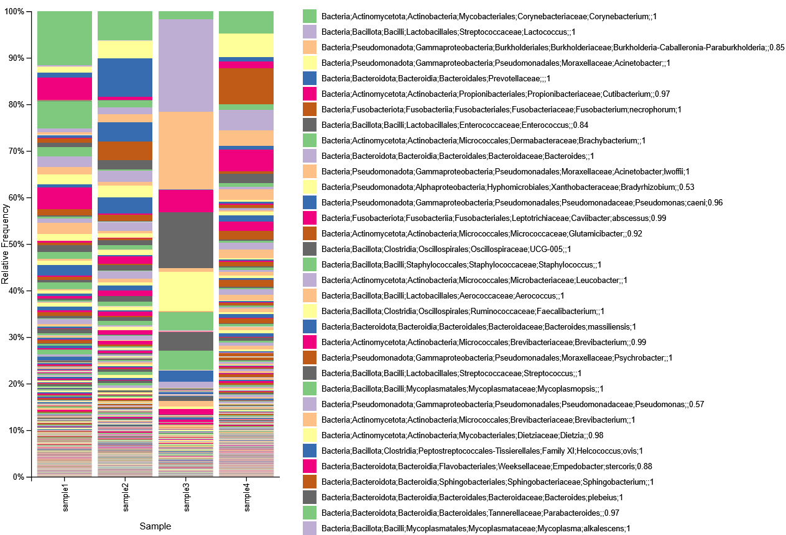
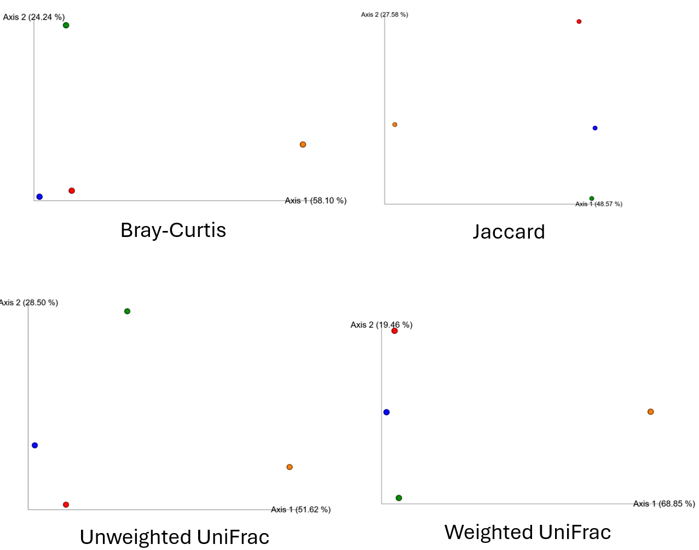
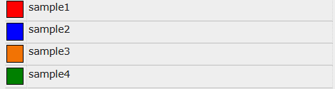

# Solutions to Technical Questions

The following questions were asked in my technical interviews. These are the solutions I provided to those problems.


## 16S rRNA Species Composition 

### Question 1

Given 16S NGS data obtained from four bovine samples, determine the species composition of each sample and the percent abundance of *Mycoplasmopsis bovis.* Indicate if there are sample differences in the species composition. Describe your choice of analysis tools and the results.

### Solution

#### Rationale

For this problem, the bioinformatics pipeline should involve quality control and trimming, ASV inference, taxonomic assignment, and diversity analysis.

I opted to go with the Nextflow/nf-core approach for two main reasons:

##### Efficiency
- Amplicon sequencing analysis is a frequently used bioinformatics workflow. As a result, an entire customizable pipleine has already been written in Nextflow and shared by the community as [nf-core/ampliseq](https://github.com/nf-core/ampliseq). Like most nf-core pipelines, it only requires a single line of code from the user to run the analysis from start to finish.
- Nextflow performs caching and checkpointing. It provides me the ability to run through several iterations of the pipeline and perform parameter optimization at each stage without starting from the beginning each time.
- Nextflow deploys very easily on High-Performance Computing (HPC) clusters and has Slurm integration. It will allow me to run several iterations on Digital Research Alliance HPC clusters and save considerable amounts of time vs. running it on a local machine.

##### Reproducibility
- Each step in the nf-core pipeline is containerized using Singularity/Apptainer on HPC. This guarantees consistency in the software dependencies and operating system for each pipeline step, no matter what machine the user utilizes to execute the workflow. As long as the methodology used is correct, the interview panel will be able to obtain the exact same results from my analysis. 

#### Methodology
Demultiplexed FASTQ files were provided for forward and reverse reads. The 515F and 806R primers for the V4 hypervariable region of the bacterial 16S rRNA were provided.

The following is the single line of code from my [shell script](question1/script.sh) used to execute the nf-core/ampliseq workflow hosted on the Digital Research Alliance Graham HPC cluster.

```
nextflow run main.nf \ 
	-profile singularity \ 
	--input $SAMPLESHEET \ 
	--FW_primer $FW_PRIMER \ 
	--RV_primer $RV_PRIMER \ 
	--outdir $OUTDIR \ 
	--dada_ref_tax_custom $REFERENCE \ 
	--dada_ref_tax_custom_sp $REFERENCE_SP \ 
	--trunc_qmin 32 \ 
	--double_primer \ 
	--vsearch_cluster \ 
	--metadata $METADATA 
```

Outside of the required input parameters (-profile, --input, --primer, --outdir, and --metadata), there are several custom parameters I have included to obtain results specific to my question.

##### Quality Control and Trimming

```
--trunc_qmin 32
```

The default setting for nf-core/ampliseq is to trim the reads at a Phred quality score of 25. I have run multiple pipeline iterations and have reached up to a cutoff of 32 within the time limit for the interview. FastQC results show that there is still more leeway for trimming.


##### ASV Inference

```
--vsearch_cluster
```

ASVs were inferred by DADA2. Initial runs resulted in certain individual species being assigned to multiple ASVs. ASV clustering with VSEARCH was performed to consolidate the ASVs toward a single species, facilitating species composition determination. Clustering the ASVs at a 97% similarity threshold effectively resolved this issue.


##### Taxonomic Assignment

```
--dada_ref_tax_custom
--dada_ref_tax_custom_sp 
```

At the time, the most current version of nf-core/ampliseq, v.1.12.0, had issues fetching reference taxonomic databases. Therefore, the SILVA 138.2 database was manually downloaded onto the Graham cluster for workflow utilization. Future steps would include iterations involving alternate databases like the Ribosomal Database Project (RDP) or Genome Taxonomy Database (GTDB).


##### Diversity Analysis

Principal coordinate analysis (PCoA) plots for the Bray-Curtis, Jaccard, unweighted and weighted Unifrac distance matrices were generated with QIIME2. Taxonomy barplots for each sample were also generated with QIIME2.


### Results

#### Species Composition




****





With the exception of samples 1 and 2 in the Bray-Curtis PCoA plot, all four samples do not cluster well in any of the four matrices. Based on the barplot and PCoA plots, the species composition differs greatly among the four samples, especially in regards to species phylogeny (UniFrac).

****
#### Percent Abundance

According to the [relative abundance tables](question1/rel_abundance_tables/) generated by QIIME2, the percent abundance of *Mycoplasmopsis bovis* is 0.41%, 0.05%, 4.15%, 0.02% for samples 1, 2, 3, and 4, respectively.